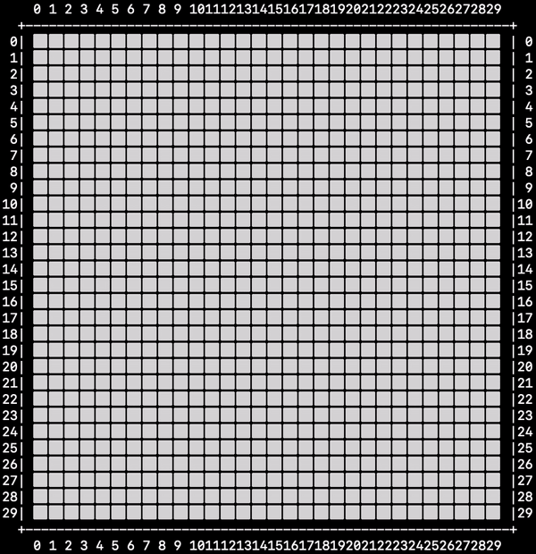

# Minesweeper

## Dean Stratakos

In this project, I implemented the classic
[**Minesweeper**](https://en.wikipedia.org/wiki/Microsoft_Minesweeper) game in
Python.

## Functionality 

* [x] Implement a playable game that runs in a terminal and accepts user input.
    * [x] Allow the user to "flag" a cell.
    * [x] If the first move is on a mine, relocate the mine.
* [x] Build a solver that attempts to solve the Minesweeper puzzles.
    * [x] The user has the option to show the solving animation or not.

## Video Walkthrough

<!-- Here's a walkthrough of playing the game:

 -->

Here's a walkthrough of running the solver:



## Instructions

### To play:

```sh
python3 play.py [ n [ num_mines ] ]
```

`n` represents the dimensions of the square board, and `num_mines` represents
the number of mines to place on the board. If `n` is too large, you will be
reprompted to enter a smaller number. If `num_mines` is too large for the
board, you will be prompted to enter a smaller number.

Make a move by entering the row and column index that you wish to uncover. For
example, if I want to uncover the cell at row 3 and column 2, I would input
`3 2` (without the quotations) with a space in between the two numbers. The
numbers must be within the boundaries of the board.

My implementation supports flagging. To flag a cell, enter `flag row col`,
where `row` and `col` are the row and column indices of the cell that you would
like to flag, respectively.

To quit the game, enter "q" as the input.

### To run the solver:

```sh
python3 run_solver.py [ n [ num_mines [ num_trials ] ] ]
```

**Performance:** On a test of 100,000 games on a 10x10 board with 10 mines, my
solver took 136.84 seconds and had a win percentage of 81.33%.

Note: the solver supports an animation of the solution. The animation looks
awesome with the following input:

```sh
python3 run_solver.py 30 90 1
```

My solver follows two main logic rules to find a set of moves to make:

 1. If the number on a cell minus the number of flagged neighbors equals the
    number of covered neighbors, the rest of the neighbors are mines, so they
    should be flagged.
    
 2. If the number on a cell minus the number of flagged neighbors equals zero,
    all mines in the neighborhood have been found, so it is safe to uncover all
    covered neighbors.

If there are no moves to make that fit under one of those two rules, it will
make a random move.

### To test:

```sh
python3 solver_test.py -v
```

## Future work

Given more time, I could increase the robustness of the solver. Rather than
taking into account just a few factors, my solver could calculate an exact
probability for each square and choose the one with the lowest probability.

I could also build up a GUI to display the game rather than having all UI
as print statements to the terminal.

## License

    Copyright 2020 Dean Stratakos

    Licensed under the Apache License, Version 2.0 (the "License");
    you may not use this file except in compliance with the License.
    You may obtain a copy of the License at

        http://www.apache.org/licenses/LICENSE-2.0

    Unless required by applicable law or agreed to in writing, software
    distributed under the License is distributed on an "AS IS" BASIS,
    WITHOUT WARRANTIES OR CONDITIONS OF ANY KIND, either express or implied.
    See the License for the specific language governing permissions and
    limitations under the License.
